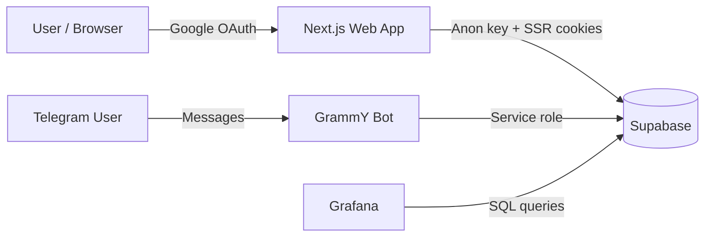

## cashBot
Multi-user personal finance tracker with a modern web dashboard + a Telegram bot.

- **Web app**: Next.js dashboard (Google OAuth, receipts, analytics)
- **Bot**: Telegram (GrammY) that turns natural language messages into transactions (OpenAI) and stores them in Supabase
- **Observability**: Grafana dashboards + Prometheus-style metrics (bot) + presence tracking (web)

> This repo is a monorepo (npm workspaces) with `apps/web` and `apps/bot`.

### Demo
- **Web dashboard**: (add screenshot) `docs/screenshots/dashboard.png`
- **Grafana**: (add screenshot) `docs/screenshots/grafana.png`

> Tip: add 1–2 screenshots and/or a short GIF. It’s the fastest way to make this repo “recruiter-friendly”.

### Key features
- **Multi-user isolation** with **Supabase RLS** (each user can only access their own rows)
- **Google login (Supabase Auth)** and server-side session handling (SSR)
- **Telegram sync** via short-lived link codes (`/settings` → generate code → send to bot)
- **AI-assisted parsing** (OpenAI) for free-form expense/income messages
- **Receipts support** via Supabase Storage (private bucket + RLS)
- **Live presence** (“connected now” + history) for Grafana

### Notable engineering decisions
- **RLS-first multi-tenancy**: data access is enforced at the database layer (Postgres RLS), not just in app code.
- **SSR-safe auth**: server-side cookie/session handling via `@supabase/ssr` to keep the app secure and fast.
- **Presence with safe writes**: a small RPC (`ping_presence`) is used to avoid client-side write pitfalls with RLS while still binding writes to `auth.uid()`.
- **Bot separation**: the bot runs with a **service role** (server-only secret) and only links users via `profiles.telegram_chat_id`.
- **Observability built-in**: Grafana for analytics + `prom-client` metrics for bot health and performance.

### Tech stack
- **Web**: Next.js 15, React 18, TypeScript, Tailwind CSS, Tremor UI
- **Bot**: Node.js, TypeScript, GrammY, OpenAI SDK
- **Backend**: Supabase (Postgres, Auth, RLS, Storage)
- **Dashboards**: Grafana (Postgres datasource)
- **Metrics**: `prom-client` (Prometheus compatible)

---

## Repo layout
- `apps/web`: Next.js (App Router) dashboard + Supabase SSR/Auth
- `apps/bot`: Telegram bot (GrammY) + OpenAI parsing + Supabase (service role)
- `supabase/migrations`: database schema + RLS policies (+ presence & receipts)

### Architecture (high level)



---

## Getting started (local)
### Prerequisites
- Node.js **20+**
- A Supabase project
- Google OAuth enabled in Supabase Auth
- Telegram bot token
- OpenAI API key (optional if you want AI parsing)

### 1) Database (Supabase)
Run migrations in Supabase SQL Editor (in order):
- `supabase/migrations/0001_init.sql`
- `supabase/migrations/0002_recurring_rules.sql`
- `supabase/migrations/0003_transactions_notes_tags_receipts.sql`
- `supabase/migrations/0004_presence.sql`
- `supabase/migrations/0005_presence_rpc.sql`

### 2) Environment variables
#### Web (`apps/web/.env.local`)
Copy `apps/web/.env.example` → `apps/web/.env.local` and fill:
- `NEXT_PUBLIC_SUPABASE_URL`
- `NEXT_PUBLIC_SUPABASE_ANON_KEY`
- `NEXT_PUBLIC_SITE_URL` (e.g. `http://localhost:3000` or your production domain)

#### Bot (`apps/bot/.env.local`)
Copy `apps/bot/.env.example` → `apps/bot/.env.local` and fill:
- `TELEGRAM_BOT_TOKEN`
- `OPENAI_API_KEY`
- `SUPABASE_URL`
- `SUPABASE_SERVICE_ROLE_KEY` (**server secret – never expose to the web app**)

### 3) Install dependencies
From repo root:

```bash
npm install
```

### 4) Run

```bash
# Web
npm run dev:web

# Bot (polling)
npm run dev:bot
```

---

## Docker (Web + Bot)
1) Create a root env file:
- Copy `.env.docker.example` → `.env`
- Fill the values (Supabase + Telegram + OpenAI)

2) Build + run:

```bash
docker compose up --build
```

---

## Deployment
### Web (Vercel)
- **Install**: `npm install`
- **Build**: `npm run build:web`
- **Env vars**:
  - `NEXT_PUBLIC_SUPABASE_URL`
  - `NEXT_PUBLIC_SUPABASE_ANON_KEY`
  - `NEXT_PUBLIC_SITE_URL` (e.g. `https://your-app.vercel.app`)

### Bot (Render/Railway/Fly/etc.)
Run as a long-lived Node.js process (polling).
- **Build**: `npm run build --workspace apps/bot`
- **Start**: `npm run start:bot`
- **Env vars**:
  - `TELEGRAM_BOT_TOKEN`
  - `OPENAI_API_KEY`
  - `SUPABASE_URL`
  - `SUPABASE_SERVICE_ROLE_KEY`

---

## Security notes (high level)
- The web app uses the **Supabase anon key** + **RLS** for per-user data access.
- The bot uses the **Supabase service role** (server-only) for privileged operations.
- Storage (receipts) is a private bucket with per-user policies.

---

## Grafana dashboards
This project stores:
- **Presence** in `presence_current` (last seen) + `presence_events` (history)
- **New users** via `public.profiles.created_at`

Example queries are typically built directly in Grafana using the Postgres datasource.

---

## Trade-offs / next steps
- **Presence sampling vs DB writes**: higher heartbeat frequency improves “connected now” accuracy but increases write load.
- **Polling bot**: kept simple (polling). A future step could be switching to webhooks for scale.
- **More dashboards**: cohort / retention views, and alerting on bot error rate and latency.

